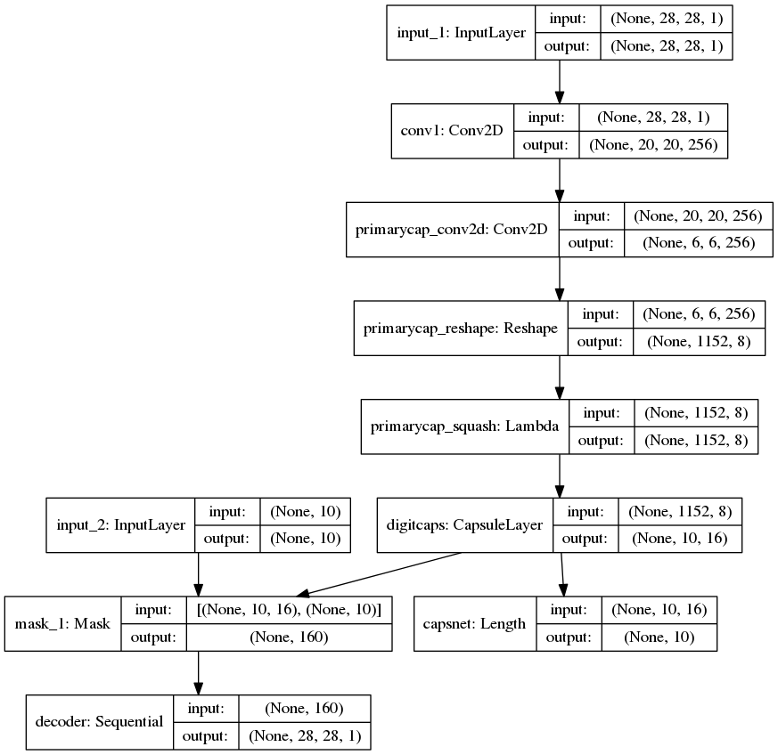

# CapsNet by tf.keras
[](https://github.com/XifengGuo/CapsNet-Keras/blob/master/LICENSE)

A tf.keras implementation of CapsNet in the paper:   
[Sara Sabour, Nicholas Frosst, Geoffrey E Hinton. Dynamic Routing Between Capsules. NIPS 2017](https://arxiv.org/abs/1710.09829)   
The current `average test error = 0.34%` and `best test error = 0.30%`.   
This repo will show how to use keras in TensorFlow v1.4.

**Differences with the paper:**   
- We use the learning rate decay with `decay factor = 0.9` and `step = 1 epoch`,    
while the paper did not give the detailed parameters (or they didn't use it?).
- We only report the test errors after `50 epochs` training.   
In the paper, I suppose they trained for `1250 epochs` according to Figure A.1?
Sounds crazy, maybe I misunderstood.
- We use MSE (mean squared error) as the reconstruction loss and 
the coefficient for the loss is `lam_recon=0.0005*784=0.392`.   
This should be **equivalent** with using SSE (sum squared error) and `lam_recon=0.0005` as in the paper.

**Recent updates:**
- Add example for multi-gpu training. On two GTX 1080Ti, speed=`55s/epoch`, in contrast to 
   `80s/epoch` on a single GTX 1080Ti.     
- Correct the *Routing algorithm*. Now the gradients in inner iterations are blocked. 
   Reorganize the dimensions of Tensors in this part and optimize some operations to speed up.
   About `100s / epoch` on a single GTX 1070 GPU.  
- Rename `dim_vector` to `dim_capsule`.   
- Change prior `b` from Variable to constant and move it from `build` to `call`.
   Although it is **equivalent** to the former version, but the current version is easier
   to understand. Thanks to [#15](https://github.com/XifengGuo/CapsNet-Keras/pull/15).   


**TODO**
- Conduct experiments on other datasets. 
- Explore interesting characteristics of CapsuleNet.

**Contacts**
- Your contributions to the repo are always welcome. 
Open an issue or contact me with E-mail `guoxifeng1990@163.com` or WeChat `wenlong-guo`.


## Usage

**Step 1.
Install [TensorFlow v1.4](https://github.com/tensorflow/tensorflow).**
```
pip install tensorflow-gpu
```

**Step 2. Clone this repository to local.**
```
git clone -b tf1.4-keras https://github.com/XifengGuo/CapsNet-Keras.git
cd CapsNet-Keras
```

**Step 3. Train a CapsNet on MNIST**  

Training with default settings:
```
python capsulenet.py
```
Training with one routing iteration (default 3).   
```
python capsulenet.py --num_routing 1
```

Other parameters include `batch_size, epochs, lam_recon, shift_fraction, save_dir` can be
passed to the function in the same way. Please refer to `capsulenet.py`

**Step 4. Test a pre-trained CapsNet model**

Suppose you have trained a model using the above command, then the trained model will be
saved to `result/trained_model.h5`. Now just launch the following command to get test results.
```
$ python capsulenet.py --is_training 0 --weights result/trained_model.h5
```
It will output the testing accuracy and show the reconstructed images.
The testing data is same as the validation data. It will be easy to test on new data, 
just change the code as you want.

You can also just *download a model I trained* from 
https://pan.baidu.com/s/1sldqQo1


**Step 5. Train on multi gpus**   

This requires `Keras>=2.0.9`. After updating Keras:   
```
python capsulenet-multi-gpu.py --gpus 2
```
It will automatically train on multi gpus for 50 epochs and then output the performance on test dataset.
But during training, no validation accuracy is reported.

## Results

**Test Errors**   

CapsNet classification test **error** on MNIST. Average and standard deviation results are
reported by 3 trials. The results can be reproduced by launching the following commands.   
 ```
 python capsulenet.py --num_routing 1 --lam_recon 0.0    #CapsNet-v1   
 python capsulenet.py --num_routing 1 --lam_recon 0.392  #CapsNet-v2
 python capsulenet.py --num_routing 3 --lam_recon 0.0    #CapsNet-v3 
 python capsulenet.py --num_routing 3 --lam_recon 0.392  #CapsNet-v4
```
   Method     |   Routing   |   Reconstruction  |  MNIST (%)  |  *Paper*    
   :---------|:------:|:---:|:----:|:----:
   Baseline |  -- | -- | --             | *0.39* 
   CapsNet-v1 |  1 | no | 0.39 (0.024)  | *0.34 (0.032)* 
   CapsNet-v2  |  1 | yes | 0.36 (0.009)| *0.29 (0.011)*
   CapsNet-v3 |  3 | no | 0.40 (0.016)  | *0.35 (0.036)*
   CapsNet-v4  |  3 | yes| 0.34 (0.016) | *0.25 (0.005)*
   
Losses and accuracies:   


**Training Speed**  

About `100s / epoch` on a single GTX 1070 GPU.   
About `80s / epoch` on a single GTX 1080Ti GPU.   
About `55s / epoch` on two GTX 1080Ti GPU by using `capsulenet-multi-gpu.py`.      

**Reconstruction result**  

The result of CapsNet-v4 by launching   
```
python capsulenet.py --is_training 0 --weights result/trained_model.h5
```
Digits at top 5 rows are real images from MNIST and 
digits at bottom are corresponding reconstructed images.


**The model structure:**  
 


## Other Implementations
- TensorFlow:
  - [naturomics/CapsNet-Tensorflow](https://github.com/naturomics/CapsNet-Tensorflow.git)   
  I referred to some functions in this repository.
  - [InnerPeace-Wu/CapsNet-tensorflow](https://github.com/InnerPeace-Wu/CapsNet-tensorflow)   
  - [chrislybaer/capsules-tensorflow](https://github.com/chrislybaer/capsules-tensorflow)

- PyTorch:
  - [timomernick/pytorch-capsule](https://github.com/timomernick/pytorch-capsule)
  - [gram-ai/capsule-networks](https://github.com/gram-ai/capsule-networks)
  - [nishnik/CapsNet-PyTorch](https://github.com/nishnik/CapsNet-PyTorch.git)
  - [leftthomas/CapsNet](https://github.com/leftthomas/CapsNet)
  
- MXNet:
  - [AaronLeong/CapsNet_Mxnet](https://github.com/AaronLeong/CapsNet_Mxnet)
  
- Chainer:
  - [soskek/dynamic_routing_between_capsules](https://github.com/soskek/dynamic_routing_between_capsules)

- Matlab:
  - [yechengxi/LightCapsNet](https://github.com/yechengxi/LightCapsNet)